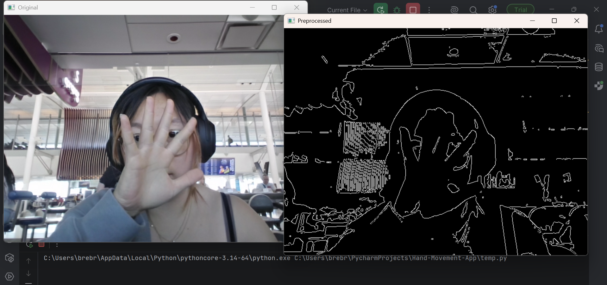

#  Logbook Entry – {06-20-2026}

##  Team
- Breanna Chin
- Ivan Castro

---

## Description

Today I missed my flight to sf. I managed to get the next one with seats at 6:30 PM (the original was 8am lol) so today I will dedicate all my time to this project. I've been so busy with work I finally have some time to work on this!

##  Objective for Today
> What was the goal for this session?

- Get camera to work
- Get hand detection working

---

##  Work Done
> What did you actually complete?

#### [b]
- Had to reinstall open cv after laptop uninstalled unsure why
- Added some test code to detect if the camera doesn't open or the frame isn't read
- Started to research how to have an accurate hand detection 
- created file `handDetection.py`
- Decided to start by testing **Edge Detection** for image preprocessing 
- Initially, I had added code to save both video files within that function in order to do the frame resizing but I quickly realized that would not work as there was no loop.
#### [i]
  - created main.py to transfer `camera.py` code
  - added code to create new mp4 file to display preprocessed on top of displaying original
  - added code to save the videos
#### [both]
  - tested image preprocessing
---

##  Technical Details
> Code changes, algorithms, parameters, etc.

- Detection method used:
- Libraries/tools:
- Key functions/modules worked on:
- Parameters tuned:

---

##  Decisions Made
> Why you chose something (VERY important)

- 
- 

---

##  Bugs / Issues
> Problems encountered

- Issue:
  - Cause:
  - Fix (if solved):

---

##  Testing Results
> What happened when you ran it?

- Camera works! 
- 

---

##  Images
> Screenshots
> 

---

##  Ideas / Thoughts
> Random ideas, future features, improvements

- 
- 

---

## ️ Next Steps
> What to do next time

- 
- 

---

##  Things to remember (old or new)

### github
- git pull origin main 
- git add -A
- git commit -m "message"
- git push origin main

- git checkout "branch" (to switch branches)
- must pull main after 

##  Contributions
- Breanna: 
- Ivan: 

